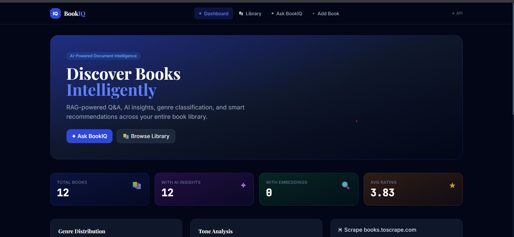
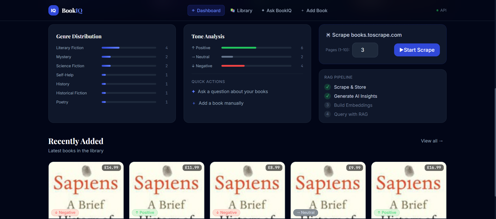
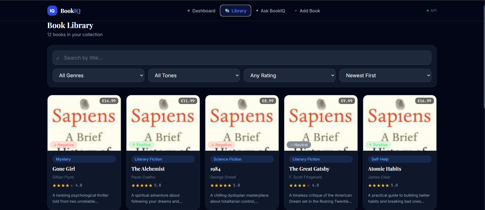
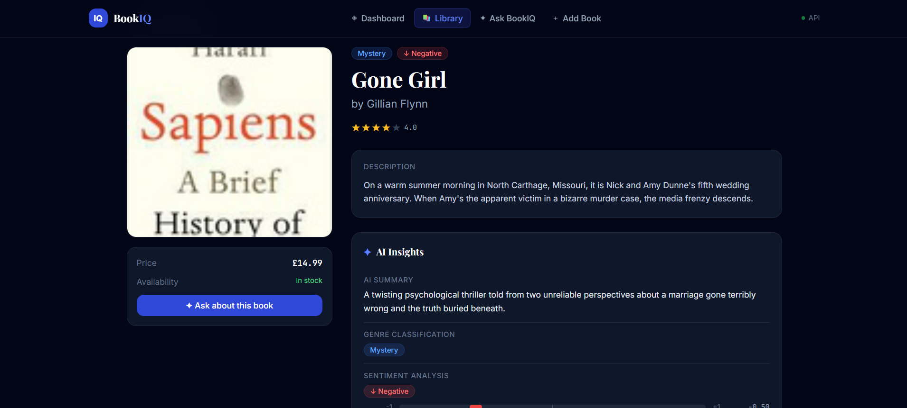
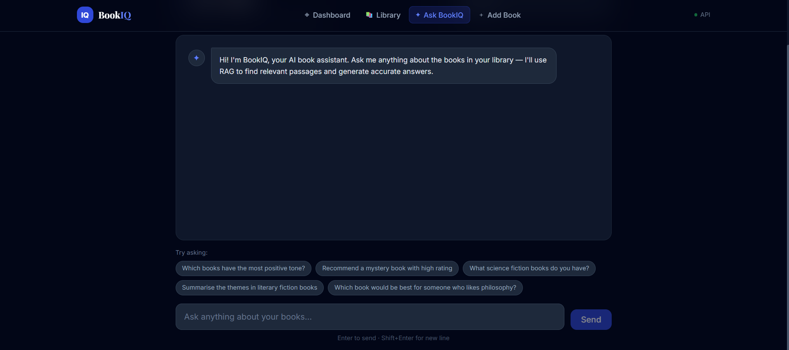
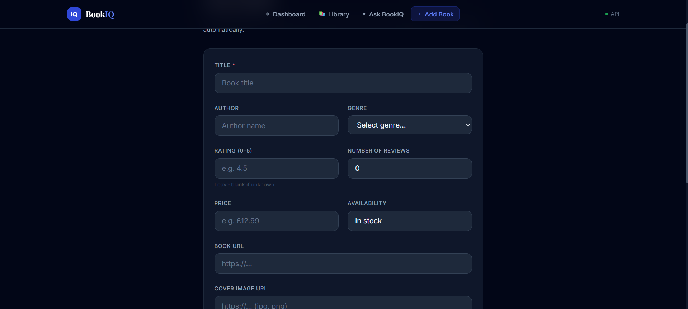

# BookIQ

A full-stack AI-powered book management system with **LangGraph agentic RAG**, automated scraping, and intelligent insights.

---

## Tech Stack
| Layer      | Technology                                      |
|------------|------------------------------------------------|
| Backend    | Django 4.2 + Django REST Framework              |
| Database   | SQLite (metadata) + ChromaDB (vectors)          |
| AI/LLM     | Groq API (llama-3.3-70b-versatile)              |
| Agent      | LangGraph (stateful multi-step RAG agent)       |
| Embeddings | sentence-transformers (all-MiniLM-L6-v2)        |
| Scraping   | requests + BeautifulSoup4 + Selenium (optional) |
| Frontend   | React 18 + Vite + Vanilla CSS                   |
| Caching    | Django file-based cache                         |

---

## Architecture
```
bookiq/
├── backend/              # Django REST Framework
│   ├── bookiq/           # Project config (settings, urls)
│   └── books/
│       ├── models.py         # Book + ScrapeLog models
│       ├── views.py          # All API endpoints
│       ├── serializers.py    # DRF serializers
│       ├── scraper.py        # Web scraper (requests + Selenium fallback)
│       ├── ai_service.py     # Groq AI + ChromaDB RAG pipeline
│       ├── agent.py          # LangGraph multi-step agent
│       └── management/commands/
│           ├── seed_books.py          # Seed sample books
│           ├── embed_books.py         # Generate ChromaDB embeddings
│           └── enrich_descriptions.py # AI-expand descriptions for richer RAG
└── frontend/             # React + Vanilla CSS
    └── src/
        ├── pages/            # Dashboard, BooksPage, BookDetail, Ask, Upload
        ├── components/       # Navbar, BookCard, shared UI
        └── services/api.js   # Axios API layer
```

---

## Setup

### 1. Backend
```bash
cd backend

# Create virtual environment
python -m venv venv
source venv/bin/activate        # Windows: venv\Scripts\activate

# Install dependencies
pip install -r requirements.txt

# Configure environment
cp .env.example .env
# Edit .env and add your GROQ_API_KEY (free at https://console.groq.com)

# Run migrations
python manage.py migrate

# Seed sample data (25 books, works without scraping)
python manage.py seed_books

# Generate embeddings for RAG (downloads model on first run ~80MB)
python manage.py embed_books --all

# Optional: Enrich descriptions using AI for richer chunking
python manage.py enrich_descriptions

# Start server
python manage.py runserver
```

Backend runs at: **http://localhost:8000**

---

### 2. Frontend
```bash
cd frontend
npm install
npm run dev
```

Frontend runs at: **http://localhost:5173**

---

## API Endpoints

### Books
| Method | Endpoint | Description |
|--------|----------|-------------|
| GET  | `/api/books/` | List all books. Supports `?search=`, `?genre=`, `?sentiment=`, `?min_rating=`, `?sort=` |
| GET  | `/api/books/<id>/` | Full book details with all AI fields |
| POST | `/api/books/` | Create/upload a book (triggers AI processing + auto-embedding) |
| GET  | `/api/books/<id>/recommendations/` | Get 4 similar books via RAG + genre matching |

### AI & RAG
| Method | Endpoint | Description |
|--------|----------|-------------|
| POST | `/api/books/ask/` | LangGraph agent Q&A — `{"question": "...", "book_id": null, "history": []}` |

### Scraping
| Method | Endpoint | Description |
|--------|----------|-------------|
| POST | `/api/scrape/` | Trigger scraping — `{"max_pages": 3, "use_selenium": false}` |
| GET  | `/api/scrape/` | List recent scrape logs |

### Stats
| Method | Endpoint | Description |
|--------|----------|-------------|
| GET | `/api/stats/` | Dashboard stats (total books, genre dist, sentiment dist) |
| GET | `/api/genres/` | List all available genres |

---

## LangGraph Agent Pipeline

The Q&A system uses a **LangGraph stateful agent** that classifies each question and routes it through an intelligent multi-step graph:

```
User Question + Chat History
         │
         ▼
   ┌──────────┐
   │ CLASSIFY  │  Groq classifies: factual | recommendation | comparison | general
   └────┬─────┘
        ▼
   ┌──────────┐
   │  SEARCH   │  Embed query → ChromaDB similarity search (top-5/8 chunks)
   └────┬─────┘
        ▼
   ┌──────────┐
   │ EVALUATE  │  Filter by relevance score (>0.15)
   └────┬─────┘
        │
   ┌────┴────────────────┐
   │                     │
   ▼ (good chunks)       ▼ (no chunks)
┌──────────┐       ┌──────────┐
│ GENERATE  │       │  ENRICH  │  Build context from DB metadata
└──────────┘       └────┬─────┘
                        ▼
                  ┌──────────┐
                  │ GENERATE  │  Groq generates answer with type-specific formatting
                  └──────────┘
```

**Key features:**
- **Question classification** adapts system prompts (comparisons get structured output, recommendations get numbered lists)
- **Contextual search** combines chat history with current question for better vector retrieval
- **Automatic fallback** from vector search to metadata when embeddings aren't available
- **Conversation memory** — frontend sends last 6 messages, agent uses them for context

---

## RAG Chunking Strategy

Smart chunking in `ai_service.py`:
1. **Paragraph split** — tries natural paragraph breaks first
2. **Sentence split** — falls back to sentence boundaries
3. **Word sliding window** — final fallback with configurable overlap
- Default: 300 words per chunk, 50-word overlap

---

## AI Features
All generated by Groq (llama-3.3-70b-versatile):

| Feature | How |
|---------|-----|
| **Summary** | 2-3 sentence summary from book description |
| **Genre Classification** | Classifies into 20 genres from description |
| **Sentiment Analysis** | Returns label (Positive/Neutral/Negative) + score (-1 to 1) |
| **Thematic Tags** | 3-5 keyword tags |
| **Recommendations** | RAG similarity + genre matching fallback |
| **Auto-Embedding** | New books are automatically chunked & embedded in ChromaDB |

---

## Frontend Pages
| Page | Route | Description |
|------|-------|-------------|
| Dashboard | `/` | Stats, genre/sentiment charts, scrape trigger, recent books |
| Library | `/books` | All books with search, filter, sort |
| Book Detail | `/books/:id` | Full details + AI insights + recommendations |
| Ask BookIQ | `/ask` | LangGraph agent chat with graph trace display |
| Add Book | `/upload` | Manual book entry form (auto-generates AI insights + embeddings) |

---

### Dashboard



### Library Page


### Book Detail Page


### Ask BookIQ (AI Chat)


### Add Book Page


---
## UI Screenshots

### Dashboard


### Library Page


### Book Detail Page


### Ask BookIQ (AI Chat)


### Add Book Page


---


## Caching
- **Scraped HTML**: File-cached in `scrape_cache/` (24h TTL) — avoids redundant HTTP requests
- **Recommendations**: Django cache (1h TTL per book)
- **Q&A results**: Django cache (30min per unique question+book combo, bypassed when conversation history is present)
- **Dashboard stats**: Django cache (5min)

---

## Notes for Evaluators
- The app works immediately after `python manage.py seed_books` — no scraping required
- Run `python manage.py embed_books --all` to activate the full RAG pipeline
- Scraping is async (background thread) so the API returns immediately
- AI processing is async per book — the book is saved first, insights + embeddings added in background
- ChromaDB is a persistent local vector store (no external service needed)
- If `GROQ_API_KEY` is not set, the app still works — AI fields will be empty but metadata queries still function
- The LangGraph agent trace is visible under each chat response (shows: classify → search → evaluate → generate)
- Selenium is optional — the scraper falls back to `requests` automatically
